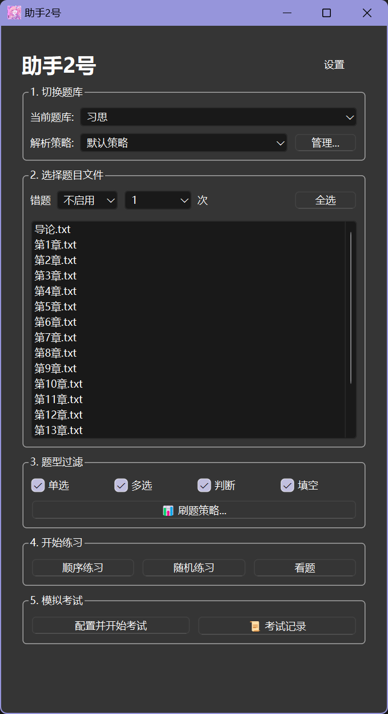

# 📚 助手2号刷题工具

[English](README_EN.md)

这是一个基于 **C++23** 和 **Qt 6** (Widgets) 开发的高性能跨平台刷题软件。

**核心目的：** 专为复习 **学习通 (Chaoxing)** 等平台的测验、作业和考试题目而设计。无需联网，支持 **自定义解析策略**，**高度可配置的刷题策略**，支持 **Windows** 和 **Android** 完美运行。



## ✨ 功能特点

### 🧠 强大解析引擎

*   **全格式支持**：完美解析 **单选题、多选题、判断题、填空题**。
*   **智能文本解析**：
    *   **零正则依赖**：采用手写高性能解析器，完美支持 **UTF-8 全角标点**（如 `．` `（` `）` `：`），彻底解决乱码和截断问题。
    *   **内联答案提取**：支持提取题目文本内部的括号答案（如 `...是（A）...`）。
    *   **策略配置**：支持自定义“开始关键词”、“答案关键词”等，适配不同来源的题库。
*   **多维度模式**：
    *   **自由刷题**：只要做对自动下一题，做错高亮。
    *   **背题模式**：直接显示答案，适合考前突击。
    *   **错题本**：自动记录错误，支持按“错误次数 ≥ N 或 = N”进行专项复习。

### 🎓 模拟考试系统

*   **全真模拟**：支持设置 **倒计时**，模拟真实考场压力。
*   **自定义配置**：自由设置各题型的 **题目数量** 和 **分数占比**。
*   **答题卡**：可视化的答题卡状态（已答/未答），一键跳转检查。
*   **成绩统计**：交卷后自动生成详细报告，计算总分、正确率及用时。

### 🛡️ 高级刷题策略

*   **智能去重**：支持多文件导入时的题目去重。
*   **垃圾题过滤**：
    *   **跳过常见答案**：一键跳过所有答案为 "A" 或 "正确" 的凑数题。
    *   **排除多选全选题**：自动识别并排除 "以上都对" 类题目。
    *   **特定选项跳过**：支持手动跳过特定选项（如 "C"）的题目。

### 📱 移动端/UI 优化

*   **原生深色模式**：基于 Qt Palette 的全局深色主题 (Dark Mode)，夜晚刷题不伤眼。
*   **丝滑布局**：遵循极简设计哲学，通过优化组件层级和动态加载逻辑，均能提供指随心动的顺滑体验。
*   **自适应布局**：字体大小和控件间距自动适配不同 DPI 屏幕。

## 🚀 快速开始

### 1. 运行软件

*   **Windows**: 直接下载 .exe。
*   **Android**: 直接下载 .apk 并安装。

### 2. 📂 如何制作题库 (核心)

本软件最强大的功能是“所见即所得”的文本导入。

1.  **获取题目文本**：
    *   在电脑浏览器打开学习通的 **作业**、**测验** 或 **考试查看试卷** 等页面。
    *   **全选页面内容**：使用快捷键 **`Ctrl + A`**。
    *   **复制** (`Ctrl + C`) 选中的所有文字。
2.  **保存文件**：
    *   新建一个 `.txt` 文本文件。
    *   粘贴内容。
    *   **⚠️ 关键**：另存为 **UTF-8** 编码格式 (防止中文乱码)。
3.  **导入**：
    *   将 `.txt` 文件放入软件识别的目录，或在软件首页直接选中该文件即可。

### 3. 数据存储说明

- 存储路径均可在主页的设置中指定
  - 你可以在example里找到以下存储示例


```cpp
├── 题库/ 
    ├── 马克思主义原理/
    │   ├── 第一章测验.txt
    │   └── 期末模拟.txt
    └── 计算机基础/
        └── 题库1.txt
```

```cpp
├── 数据/
    ├── config.json              // 全局配置 (主题、字体、上次状态)
    ├── exam_configs.json        // 考试模式的预设配置
    ├── history.json             // 历次考试成绩记录
    ├── mistakes.json            // 错题数据库 (存储题目ID和错误次数)
    ├── parser_strategies.json   // 自定义的文本解析策略
    └── practice_strategies.json // 刷题过滤策略
```

## ⚙️ 使用技巧

- **解析策略**：如果导入的题目识别不准（例如答案有的叫“我的答案”，有的叫“标准答案”），请在“解析策略管理”中添加对应的关键词。
- **组合刷题**：首页支持按住 `Ctrl` 或多选框同时选中多个题库文件，系统会自动合并题目。
- **状态记忆**：软件会自动记住你上次的答题进度、选中的文件和开启的策略。

## 📝 License

本项目采用 **MIT License** 开源许可证。

这意味着你可以自由地使用、复制、修改、合并、出版发行、散布、再授权及贩售本软件的副本，只需包含原作者的版权声明和许可声明即可。

------

### The MIT License (MIT)

Copyright (c) 2026 Iviesever

Permission is hereby granted, free of charge, to any person obtaining a copy of this software and associated documentation files (the "Software"), to deal in the Software without restriction, including without limitation the rights to use, copy, modify, merge, publish, distribute, sublicense, and/or sell copies of the Software, and to permit persons to whom the Software is furnished to do so, subject to the following conditions:

The above copyright notice and this permission notice shall be included in all copies or substantial portions of the Software.

THE SOFTWARE IS PROVIDED "AS IS", WITHOUT WARRANTY OF ANY KIND, EXPRESS OR IMPLIED, INCLUDING BUT NOT LIMITED TO THE WARRANTIES OF MERCHANTABILITY, FITNESS FOR A PARTICULAR PURPOSE AND NONINFRINGEMENT. IN NO EVENT SHALL THE AUTHORS OR COPYRIGHT HOLDERS BE LIABLE FOR ANY CLAIM, DAMAGES OR OTHER LIABILITY, WHETHER IN AN ACTION OF CONTRACT, TORT OR OTHERWISE, ARISING FROM, OUT OF OR IN CONNECTION WITH THE SOFTWARE OR THE USE OR OTHER DEALINGS IN THE SOFTWARE.

------

#### **关于 Qt 静态链接的合规性提醒**

本项目（.exe）使用了开源版本的 Qt 6 框架 (LGPLv3) 并进行了**静态链接**。
根据 LGPLv3 协议要求，作者已在 GitHub **[object_files.zip](https://github.com/Iviesever/Helper-02/blob/main/object_files.zip)** 提供了本程序编译后的**对象文件压缩包**。
如果您希望使用不同版本的 Qt 库重新链接本程序，请下载该压缩包并使用您的链接器进行操作。

#### **法律免责声明**

1.  **仅供学习交流**：本项目及其相关代码、文档仅供计算机技术学习、研究和交流使用。
2.  **无担保声明**：本项目按“原样”提供，作者**不提供任何形式的明示或暗示的保证**，包括但不限于适销性、特定用途适用性或不侵权的保证。用户应自行承担使用本软件的所有风险。
3.  **合规性提示**：上述关于 Qt 开源许可的说明仅为作者基于个人理解的**友情提示**，**并不构成任何形式的法律建议**。作者并非法律专业人士，无法保证上述解读的准确性或全面性。请您在商业使用、分发或修改本程序前，务必自行咨询专业法律意见或详细阅读 [Qt LGPLv3 协议原文](https://www.gnu.org/licenses/lgpl-3.0.html)。
4.  **责任豁免**：在法律允许的最大范围内，作者对因使用或无法使用本软件（及其衍生作品）所产生的任何直接、间接、意外、特殊或后果性的损害（包括但不限于数据丢失、设备故障、业务中断或法律纠纷）**概不负责**。
